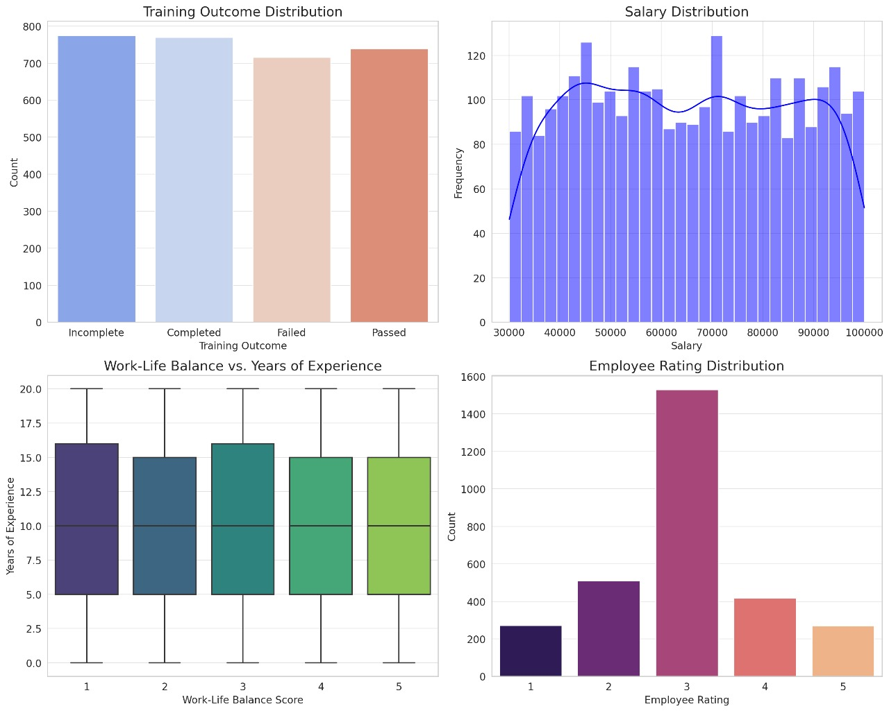

<h1 align="center">🏆 Human Resources Analytics Project</h1>

  

# 💡 About the Project 
This project was developed as part of the **Digital Egypt Pioneers Initiative (DEPI)** under the supervision of industry experts. It focuses on analyzing HR data using **Python (Jupyter Notebook), SQL Server, Excel, and Tableau**, along with other essential data analytics tools.  

# 🚀  Tech Stack

This project harnesses powerful tools for seamless data processing, analysis, and visualization:

- **🐍 Python** (Pandas, NumPy, Matplotlib, Seaborn) - Data manipulation & insightful trend visualization.
- **🗄️ SQL Server** - Fast & efficient data extraction, transformation, and complex querying.
- **📊 Excel** (Power Query & Pivot Tables) - Smart data cleaning, transformation, and dynamic analysis.
- **📈 Tableau** - Interactive dashboards, real-time insights, and visually compelling analytics.

## 📊 HR Analytics Dashboard  

### 🖥️ Visual Representation:
📌 The dashboards below provide an interactive overview of these key HR metrics:

)  

---

  

---  

## 🔹 **Key Insights from the Dashboard**
- **👥 Total Hired:** *2,458* | **📉 Turnover:** *12.9%* | **💰 Avg. Training Cost:** *$558.6*  
- **📊 Gender Headcount:** *Male: 44% ($65,444)* | *Female: 56% ($64,793)*  
- **😊 Employee Satisfaction:** *Highest: 369 (Female)* | *Lowest: 243 (Male)*  
- **📈 Performance by Age:** *Most employees fully meet expectations; few need improvement (PIP)*  
- **🏢 Highest Turnover Departments:** *Sales, Production, Software Engineering*  
  - *Includes voluntary, involuntary, resignation, & retirement*  
--- 
 
### 🎥 Explore More About the Dashboard  
🔹 Watch the **interactive dashboard video**:  [**Here**](https://drive.google.com/file/d/1BjdJeIXb2auuJ5Lr9ByYCFW3NGsT3kV-/preview)

---

##  ERD digrame:

---

## SCHEMA overview:

## 📅 Project Timeline 
The project was completed over a span of **4 weeks**, with each week focusing on a different aspect of HR data analysis:  

| 📆 **Weeks**     | 📌 **Activities**  |
|-----------------|------------------|
| 1️⃣ **Week 1:** Data Cleaning & Preparation  | - Processed and cleaned raw HR data.    - Handled missing values, duplicates, and inconsistencies.  |
| 2️⃣ **Week 2:** Analytical Insights  | - Formulated key business questions.    - Conducted exploratory data analysis (EDA) and visualized findings.  |
| 3️⃣ **Week 3:** Forecasting & Predictive Analysis  | - Applied predictive modeling techniques.    - Generated forecasts for employee performance and retention.  |
| 4️⃣ **Week 4:** Dashboard & Final Presentation  | - Developed an interactive **Tableau dashboard** for data visualization.    - Summarized findings and presented key takeaways.  |

---

## 📈 Forecasting Dashboard 🖼️

  

## 📈 Forecasting Methodology  

| 🔹 Step                 | 📝 Description |
|-------------------------|------------------------------------------------|
| **Data Preprocessing**  | Cleaned HR data, handled missing values, and ensured consistency. |
| **Exploratory Data Analysis (EDA)**  | Analyzed employee engagement trends, training costs, and workforce distribution. |
| **Model Selection**     | Applied predictive analytics for turnover forecasts and satisfaction scores. |
| **Forecast Visualization** | Created interactive **Tableau dashboards** showcasing workforce trends and projections. |
| **Evaluation & Insights**  | Measured prediction accuracy, identified key turnover factors, and optimized HR strategies. |

---

## 🏢 visualization charts preview:

  

---

##  👥 Meet Our Team
We are a dedicated team committed to delivering high-quality HR analytics solutions.
- **[Omar Ragab Ali](https://www.linkedin.com/in/omar-rageb)**
- **[Sereen Ahmed Saeed](https://www.linkedin.com/in/sereen-alsid-16993231a)**
- **[Rahma Mohamed Saad](https://www.linkedin.com/in/rahma-mohammed-326167295)**
- **[Youssef Ayman Abdel-Sabour](https://www.linkedin.com/in/youssefayman8)**
- **[Mazen Abu Bakr Mohamed](http://linkedin.com/in/mazen-el-nady-39b054289)**

## 🎯 Conclusion

This project aims to provide accurate analytical insights into human resources, helping companies make informed decisions to improve performance, reduce turnover rates, and increase employee satisfaction. By leveraging advanced data analysis techniques, organizations can identify key trends and understand the factors influencing the workplace environment.

🚀 We hope this project serves as an effective tool for HR decision-makers, contributing to a more efficient and productive work environment.

